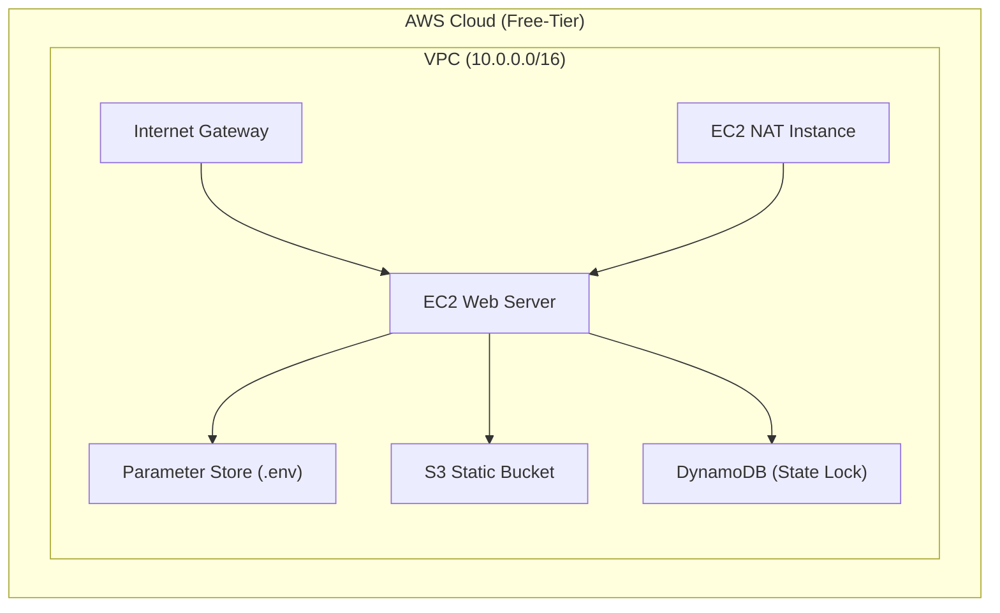

# ☁️ Terraform Free-Tier AWS Infrastructure Lab

## 📖 프로젝트 개요

이 프로젝트는 **AWS Free-Tier 한도 내에서 Terraform을 사용하여 완전한 클라우드 인프라를 자동 구성**하는 실습용 DevOps 프로젝트입니다.  
비용을 발생시키지 않으면서도, 실제 프로덕션 수준의 인프라 설계 및 IaC(Terraform) 관리 방법을 학습하기 위함입니다.

---

## 🧱 아키텍처 구성도

| 구성요소                   | 설명                            | Free-Tier 유지 전략   |
| ---------------------- | ----------------------------- | ----------------- |
| **VPC**                | 1개 Public + 1개 Private Subnet | CIDR 최소화 (/28)    |
| **EC2 (Web)**          | Public Subnet에 배포             | `t3.micro` 사용     |
| **EC2 (NAT Instance)** | Private Subnet의 NAT 역할        | NAT Gateway 미사용   |
| **S3 (Static)**        | 정적 자산 및 tfstate 저장            | Versioning 비활성    |
| **DynamoDB**           | Terraform state lock 테이블      | PAY_PER_REQUEST   |
| **Parameter Store**    | 환경 변수 관리                      | 표준(Standard) Tier |
| **IAM Role**           | Terraform 실행용 권한              | 최소권한 원칙 적용        |

주요 기술 스택
| 구분                 | 기술                                                      |
| ------------------ | ------------------------------------------------------- |
| **IaC 도구**         | Terraform `>= 1.8.0`                                    |
| **Cloud Provider** | AWS Free-Tier (VPC, EC2, S3, DynamoDB, Parameter Store) |
| **State Backend**  | S3 + DynamoDB                                           |
| **OS / 런타임 환경**    | Amazon Linux / EC2 Instance                             |
| **버전 관리**          | Git / GitHub                                            |
| **다이어그램 작성**       | Mermaid (Markdown 렌더링용)                                 |

IAM Role 구성
| 정책 이름                          | 설명                                     |
| ------------------------------ | -------------------------------------- |
| `AmazonS3FullAccess`           | S3 버킷(tfstate, static asset 등) 접근      |
| `AmazonDynamoDBFullAccess`     | Terraform state lock 테이블 접근            |
| `AmazonSSMManagedInstanceCore` | Session Manager 접속, Parameter Store 접근 |

